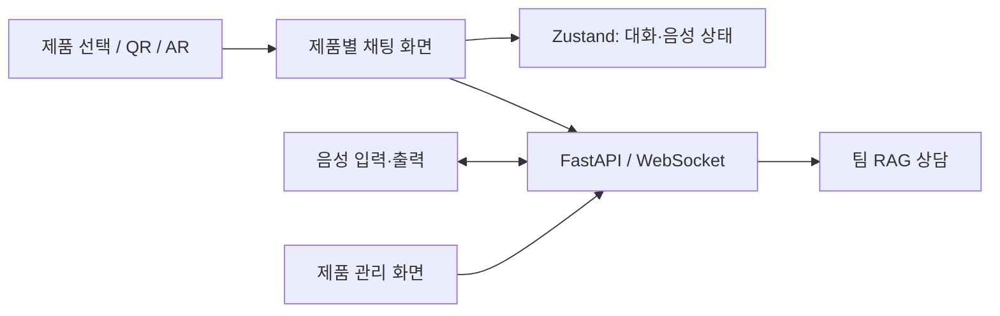

# ManuAI-talk — 제품 매뉴얼 AI 상담

제품 매뉴얼 기반 AI 상담에 채팅·음성·제품 관리·QR·AR 화면을 연결한 팀 프로젝트입니다.
**프런트엔드를 주로 맡아 사용자 흐름을 구현·개선하고, 관련 백엔드 개발을 보조했습니다.**

| 기간 | 역할 | 수상 |
|---|---|---|
| 2025.09.25~12.10 | 6인 팀 · 프런트엔드 주담당 / 백엔드 보조 | 광주인공지능사관학교 우수상 · 2025.12.11 |

기간은 기획 포함 WBS 기준입니다. 기업 연계 개발 기간은 2025.10.20~12.10입니다.

## 내가 맡은 일

| 핵심 기여 | 구현 내용 | 근거 |
|---|---|---|
| 채팅·대화 기록 | 제품별 채팅, 세션·응답·상태 관리 화면 | [채팅 Hook](Full/Frontend/src/features/chat/hooks/useChat.ts) · [개선 커밋](https://github.com/TextNest/PandDF_ManuAITalk/commit/dd13b0bd1bb44d30f130fde9a56fd77414f138e5) |
| 음성 입출력 | STT/TTS 연결·복구, 음성 재생과 상태 관리 | [TTSPlayer](Full/Frontend/src/components/chat/TTSPlayer/TTSPlayer.tsx) · [음성 처리](Full/Frontend/src/features/chat/utils/tts.ts) |
| 제품·QR·AR 연동 | 제품 관리, QR 연결, AR 화면에서 챗봇으로 이동 | [QR 수정](https://github.com/TextNest/PandDF_ManuAITalk/commit/29dbad86a6e2208bd9bb721cd975af7d42ca7b3e) · [AR UI](Full/Frontend/src/components/ar/ARUI.tsx) |

RAG 검색·모델 전반은 팀 구현입니다. 개인 역할은 사용자 화면과 서비스 연동을 중심으로 설명합니다.

## 결과와 문제 해결

- 채팅·대화 기록·음성 기능과 제품/QR/AR 진입 흐름을 연결했습니다.
- 팀 프로젝트로 **2025.12.11 광주인공지능사관학교 우수상**을 받았습니다.

**STT/TTS 복구와 재생 상태 정리**

음성 기능 복구 과정에서 채팅 상태 저장소와 재생 컴포넌트를 함께 수정했습니다.
재생 시작·종료·오류 콜백을 상태에 연결하고, 컴포넌트 정리 시 스트림과 오디오 리소스를 해제하도록 구성했습니다.

[복구 커밋](https://github.com/TextNest/PandDF_ManuAITalk/commit/dd13b0bd1bb44d30f130fde9a56fd77414f138e5) · [현재 TTS 구현](Full/Frontend/src/features/chat/utils/tts.ts)

## 구조와 사용자 흐름

**사용 흐름**

1. 제품을 선택하거나 QR·AR 화면에서 상담으로 이동합니다.
2. 제품별 대화 세션에서 텍스트·음성으로 질문합니다.
3. 답변과 대화 기록을 확인하고 음성으로 재생합니다.

주요 기술: **Next.js · React · TypeScript · Zustand · FastAPI · WebSocket · Three.js**

기존 공개 데모는 **현재 접속 불가**입니다(2026.09.20 HTTP 404 확인).
현재 서비스의 응답 품질·음성 재생 성공률은 별도로 측정하지 않았습니다.

## 더 보기

- [실행 방법·코드 입구](docs/portfolio-guide.md)
- [프런트엔드](Full/Frontend) · [백엔드](Full/Backend)
- [팀 저장소](https://github.com/TextNest/PandDF_ManuAITalk)

이 저장소는 팀 프로젝트의 개인 포트폴리오용 포크입니다. 팀원의 기여와 원본 이력을 보존합니다.
