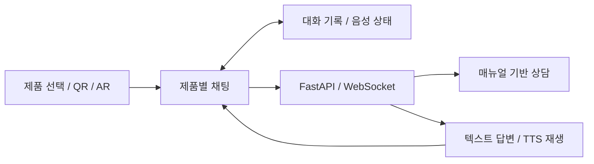

# ManuAI-talk

제품 매뉴얼을 바탕으로 사용자의 질문에 답하는 AI 상담 서비스입니다.
6인 팀에서 프런트엔드를 주로 맡았고, 필요한 백엔드 작업을 함께 했습니다. 제품별 채팅, 대화 기록, 음성 입출력과 제품 관리·QR·AR 화면을 구현·개선했습니다.

2025.09.25~12.10 · 광주인공지능사관학교 6기

**광주인공지능사관학교 우수상 · 2025.12.11**

## 제가 맡은 화면과 기능

사용자가 제품을 선택하거나 QR·AR 화면에서 들어오면, 해당 제품의 매뉴얼을 바탕으로 대화할 수 있도록 연결했습니다.
팀에서 만든 RAG 상담 API에 채팅 화면을 연결하고, 제품별 대화 세션과 메시지 상태는 Zustand로 관리했습니다.

- **채팅·대화 기록:** 제품별 채팅과 이전 대화 조회 화면을 만들고, WebSocket 응답을 화면에 반영했습니다. [채팅 Hook](Full/Frontend/src/features/chat/hooks/useChat.ts)
- **음성 입출력:** 녹음한 음성을 STT API로 보내고, 답변을 TTS로 재생하도록 연결했습니다. [음성 재생 코드](Full/Frontend/src/features/chat/utils/tts.ts)
- **제품·QR·AR:** 제품 조회·수정·삭제 화면과 QR 연결을 작업하고, AR 화면에서 챗봇으로 이동하는 흐름을 개선했습니다. [QR 작업](https://github.com/TextNest/PandDF_ManuAITalk/commit/29dbad86a6e2208bd9bb721cd975af7d42ca7b3e) · [AR 화면](Full/Frontend/src/components/ar/ARUI.tsx)

## 음성 기능을 복구하면서

STT/TTS를 복구할 때 음성 처리 코드와 채팅 상태를 함께 수정했습니다.
재생 시작·종료·오류에 따라 화면 상태가 바뀌도록 `TTSPlayer`와 상태 저장소를 연결했습니다.

자동 재생이 켜져 있어도, 직전 입력이 음성이었을 때만 답변 재생 후 녹음을 다시 시작하도록 했습니다.
재생 컴포넌트가 정리될 때는 WebSocket과 오디오 리소스도 함께 정리하도록 처리했습니다.

[복구 커밋](https://github.com/TextNest/PandDF_ManuAITalk/commit/dd13b0bd1bb44d30f130fde9a56fd77414f138e5) · [TTSPlayer](Full/Frontend/src/components/chat/TTSPlayer/TTSPlayer.tsx)

## 사용 기술

Next.js · React · TypeScript · Zustand · FastAPI · WebSocket · Three.js

## 실행과 문서

- [실행 안내·코드 위치](docs/portfolio-guide.md)
- [프런트엔드](Full/Frontend) · [백엔드](Full/Backend)
- [원본 팀 저장소](https://github.com/TextNest/PandDF_ManuAITalk)

기존 공개 데모는 현재 접속되지 않습니다(2026.09.20 확인).
